# After She Left — Product & Engineering Blueprint

> Turn what hurt into who you become.

A React Native (Expo) Android app that helps one person grow after a painful breakup or hard
season. It turns **mistakes into rules** that resurface at the right moment, builds **habits** the
Atomic Habits way, keeps **goals written as if already achieved**, and opens every day with a short
**prayer** composed from the person's own records.

This document describes the product, the design system and the architecture **as built** in this
repository. Screenshots live in [`docs/screenshots`](docs/screenshots).

| Today | Habits | Lessons | Prayer | Pricing |
|---|---|---|---|---|
| 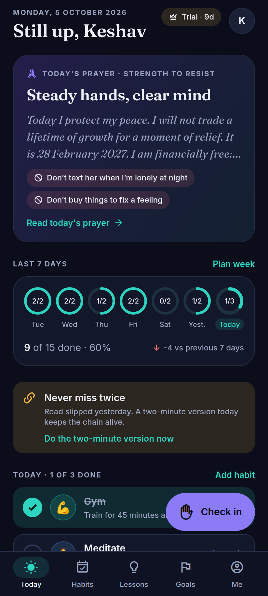 | 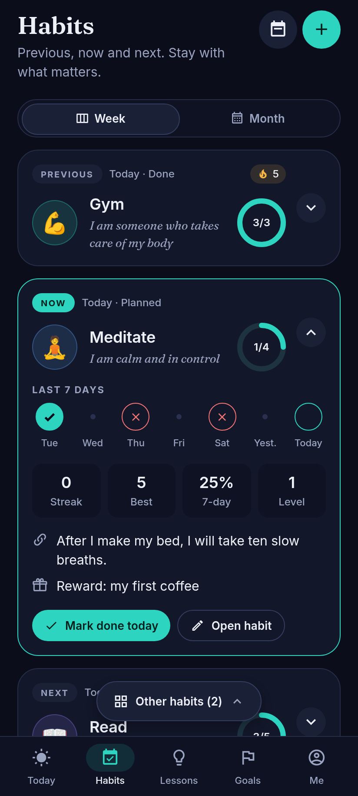 | 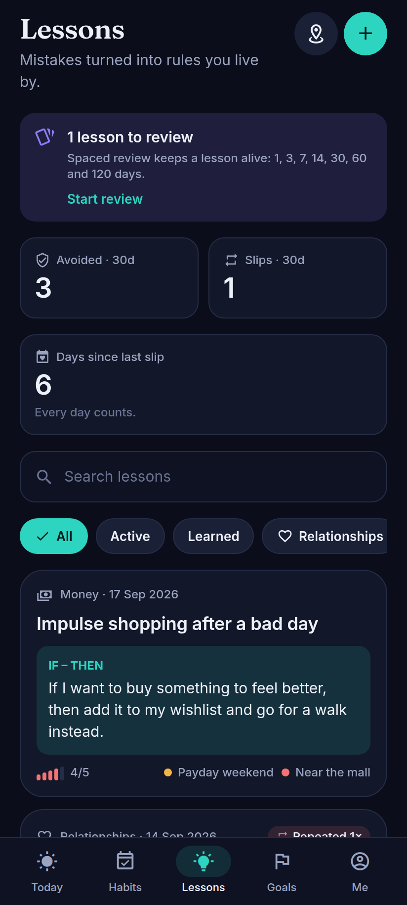 | 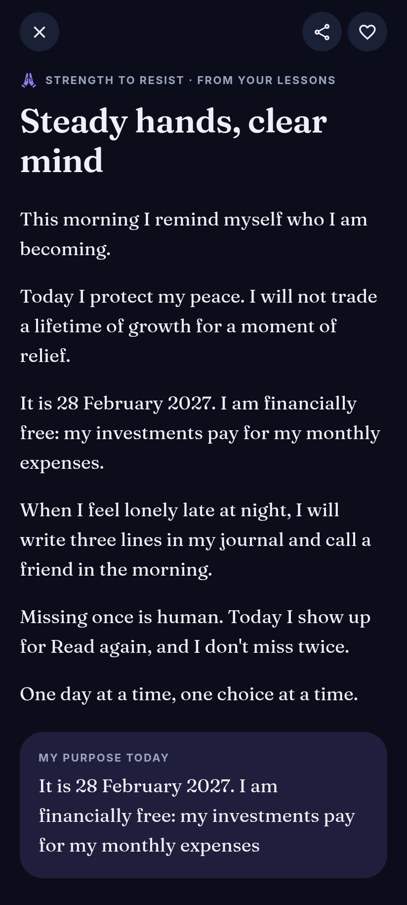 | 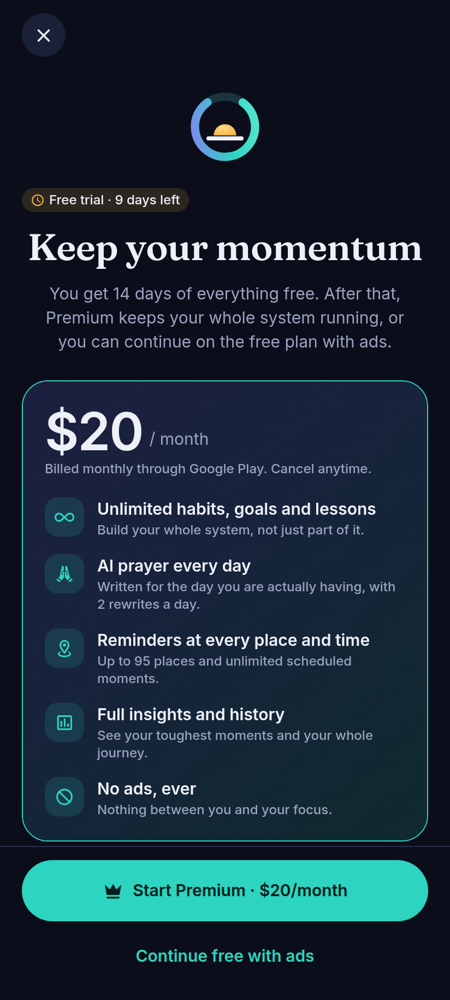 |

---

## Contents

1. [Vision & principles](#1-vision--principles)
2. [Core concepts](#2-core-concepts)
3. [Feature list](#3-feature-list)
4. [Tech stack](#4-tech-stack)
5. [Architecture](#5-architecture)
6. [Data model](#6-data-model)
7. [Screens & navigation](#7-screens--navigation)
8. [Habit system (Atomic Habits)](#8-habit-system-atomic-habits)
9. [Daily prayer (AI)](#9-daily-prayer-ai)
10. [Reminder engine](#10-reminder-engine)
11. [Pricing, trial, ads & limits](#11-pricing-trial-ads--limits)
12. [Security & privacy](#12-security--privacy)
13. [Design system: Calm night](#13-design-system-calm-night)
14. [Code layout](#14-code-layout)
15. [Testing & verification](#15-testing--verification)
16. [Play Store checklist](#16-play-store-checklist)
17. [Roadmap](#17-roadmap)

---

## 1. Vision & principles

- **Focus on what is important.** Every screen shows little and hides the rest one tap away. The
  Habits tab shows only *Previous · Now · Next*; everything else sits behind one button.
- **Kind but firm.** Slips are recorded honestly and met with compassion, never shame.
- **Small and consistent beats big and occasional.** Beginner mode, two-minute versions and
  "never miss twice" are built in, not optional advice.
- **Private by default.** Local-first storage, an app lock, neutral notification text, and an AI
  prayer that only ever receives a minimal summary.
- **Non-goals.** No social feed, no streak-shaming, not a replacement for therapy.

## 2. Core concepts

| Concept | What it is | Key fields |
|---|---|---|
| **Mistake** (lesson) | Something you did and don't want to repeat | title, story, why, date, category, severity 1–5, emotions |
| **Solution** | Embedded in a mistake | summary, steps, **if–then rule**, one-line **"don't"** |
| **Circumstance** | A reusable trigger: a moment, time or place | name, icon, colour, optional **schedule** (weekdays + time), optional **location** (lat/lng, radius, on arrive/leave), cooldown |
| **Check-in** | "I'm in this situation now" | circumstance, lessons shown, outcome **avoided / repeated** |
| **Review state** | Spaced repetition per lesson | stage (1·3·7·14·30·60·120 days), next review, lapses |
| **Goal** | Specific, dated, measurable | title, **affirmation written as already achieved**, measure, **real** target date, optional time, place, why, milestones, linked habits |
| **Habit** | Identity-based, weekly-target habit | identity, two-minute + full version, level, **weekly target**, preferred days, time window, implementation intention, stack anchor, reward, temptation bundle, hard flag |
| **Habit log** | One per habit per planned day | `habitId_day`, status planned / done / skipped, difficulty rating |
| **Prayer** | Today's prayer | title, text, purpose line, "not today" list, 3 nudges, theme, source (cloud AI / on-device AI / template) |
| **Plan** | Pricing state | tier trial / premium / free, trial end, premium until, source local/server |

> Goal dates are picked from a calendar grid, so only real dates exist: 29 February can only be
> chosen in leap years (2028, 2032…). The original example "29 Feb 2027" becomes 28 Feb 2027.

## 3. Feature list

| Area | Feature | Status |
|---|---|---|
| Lessons | Record mistake → why → if–then solution → circumstances (5-step wizard) | ✅ Built |
| | Circumstances with time schedule and/or geofenced place | ✅ Built |
| | Check-in flow with swipeable lesson cards and 60-second breathing ("urge surfing") | ✅ Built |
| | Spaced review flashcards (1/3/7/14/30/60/120 days); relapse restarts the schedule | ✅ Built |
| Habits | Weekly targets, auto-distributing weekly planner, move/skip | ✅ Built |
| | Beginner mode, Goldilocks level-up/scale-down, rewards, never miss twice | ✅ Built |
| | Habit viewer: Previous · Now · Next with Week/Month views, "Other habits" sheet | ✅ Built |
| Dashboard | Prayer card, **last-7-days rings**, today's checklist, lessons today, goal affirmation | ✅ Built |
| Goals | Specificity checklist, "write it for me" affirmation, milestones, linked habits | ✅ Built |
| Prayer | Needs analyzer + template composer (free); Premium AI: Gemini Nano on the phone, else Claude Haiku 4.5 via a Cloud Function | ✅ Built (Gemini Nano needs on-device QA) |
| Pricing | 14-day trial, $20/month Premium (RevenueCat), free tier with limits + ads (AdMob) | ✅ Built |
| Privacy | Biometric/PIN lock, FLAG_SECURE, private notifications, JSON export | ✅ Built |
| Cloud | Email sign-in, Firestore sync (last-write-wins), server-owned plan & quota | ✅ Built (needs a Firebase project) |
| Later | Home-screen widget, app shortcuts, end-to-end encryption, Google sign-in | 🔜 Roadmap |

## 4. Tech stack

| Concern | Choice | Why |
|---|---|---|
| Framework | **Expo SDK 57**, React Native 0.86, React 19.2, TypeScript, React Compiler | One codebase, OTA updates, config plugins instead of hand-edited native code |
| Navigation | **expo-router** (native Stack + JS Tabs with a custom tab bar) | File-based routes, deep links from notifications |
| State | **zustand** + `persist` → AsyncStorage | Tiny, synchronous, easy to unit-test; local-first |
| Animation | **Reanimated 4** (`.get()/.set()` for React Compiler), react-native-svg | Rings, accordions, sheets, checkbox pop |
| Fonts | Inter (UI) + Fraunces (prayers, titles) via `@expo-google-fonts` | Calm, editorial feel |
| Cloud (optional) | **Firebase JS SDK v12** (Auth + Firestore + Functions) | Works in Expo Go and on the web; activated by env vars |
| On-device AI | **Gemini Nano** via the ML Kit GenAI Prompt API (`com.google.mlkit:genai-prompt`), local Expo module `modules/gemini-nano`; `minSdkVersion 26` via `expo-build-properties` | $0 per prayer and nothing leaves the phone; Android AICore ships and updates the model |
| Cloud AI | **Claude API** (`claude-haiku-4-5`, structured JSON output) from a Cloud Function, only for Premium phones without Gemini Nano | Key stays in Secret Manager; quota enforced server-side; ~$0.004 per prayer |
| Notifications | `expo-notifications` local schedules, channels and action buttons | No push server needed |
| Location | `expo-location` geofencing + `expo-task-manager` | Reminders when arriving at/leaving places |
| Background | `expo-background-task` | Twice-daily refresh of the 7-day reminder window |
| Security | `expo-local-authentication`, `expo-screen-capture` | Biometric/PIN lock, hide from recents |
| Billing | **RevenueCat** (`react-native-purchases`) over Google Play Billing | Trials, entitlements, webhooks without running a receipt server |
| Ads | **AdMob** (`react-native-google-mobile-ads`) + UMP consent | Free tier only; split into `ads.native.ts` / `ads.ts` so web never bundles it |
| Build | EAS Build (`eas.json`: development, preview APK, production AAB) | No local Android Studio required |

**Deliberate change from the first draft:** the blueprint originally proposed
`@react-native-firebase`. The build uses the **Firebase JS SDK** instead so the app runs fully
**without any backend** (local-first) and also on the web/Expo Go; cloud sync switches on only when
`EXPO_PUBLIC_FIREBASE_*` variables are present.

**Alternatives considered:** Supabase (great, but Firebase Auth + Functions + Firestore offline fit
better), bare React Native CLI (more native maintenance), Notifee (expo-notifications is enough), a
bundled on-device LLM such as llama.cpp (hundreds of MB in the APK; Gemini Nano is used instead
because Android ships the model), free hosted models (rate limits and data-use terms unsuitable for
personal content), `react-native-iap` without RevenueCat (would need our own receipt validation
server).

## 5. Architecture

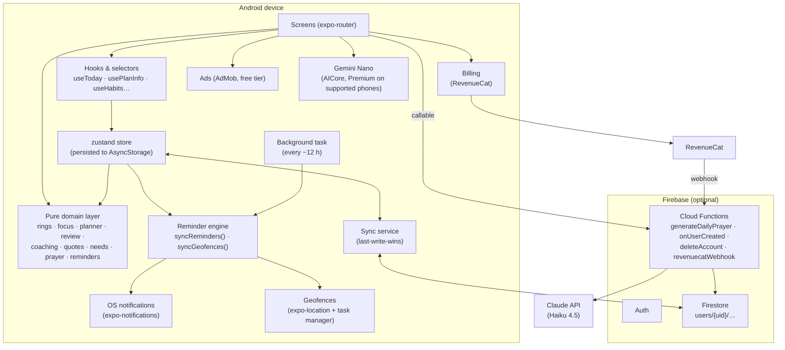

**Principles**

- The **domain layer** (`src/domain`) is pure TypeScript with no React Native imports. Everything
  that decides *what* happens (which rings, which habit is "Now", what to remind, which prayer
  theme) is a tested pure function.
- **Services** wrap native modules behind platform guards (`Platform.OS !== 'web'`, Expo Go
  detection, `.native.ts` splits), so the same code runs on Android, in Expo Go and on the web.
- The **store** is the single source of truth on the device. Actions enforce limits and return
  `ActionResult` (`ok` / `limit` / `beginner`), which the UI turns into an upsell dialog.

## 6. Data model

Firestore layout (mirrors the local store; documents carry `id`, `createdAt`, `updatedAt`, and a
`deletedAt` tombstone so deletes sync):

```
users/{uid}                     profile, plan (server-only), usage (server-only)
users/{uid}/mistakes/{id}       Mistake (+ embedded solution and review state)
users/{uid}/circumstances/{id}  Circumstance (schedule?, location?)
users/{uid}/checkins/{id}       Check-in
users/{uid}/goals/{id}          Goal (+ milestones)
users/{uid}/habits/{id}         Habit
users/{uid}/habitLogs/{habitId}_{YYYY-MM-DD}   deterministic id → idempotent writes
users/{uid}/prayers/{YYYY-MM-DD}
```

Example documents:

```jsonc
// users/{uid}/habits/h_gym
{ "id": "h_gym", "name": "Gym", "emoji": "💪", "identity": "I am someone who takes care of my body",
  "twoMinute": "Put on my gym clothes", "full": "Train for 45 minutes", "level": 2,
  "weeklyTarget": 3, "preferredDays": [], "timeWindow": "morning", "hard": true,
  "intention": { "behavior": "train", "when": "before work", "where": "the gym near home" },
  "stackAfter": "I drink my morning water", "reward": "a protein smoothie", "status": "active",
  "updatedAt": 1791190000000 }

// users/{uid}/goals/g_money
{ "title": "Financial freedom", "targetDate": "2027-02-28", "targetTime": { "hour": 9, "minute": 0 },
  "affirmation": "It is 28 February 2027. I am financially free: my investments pay for my monthly expenses",
  "measure": "Passive income ≥ ₹60,000 per month", "place": "At my desk at home", "status": "active" }

// users/{uid}  (plan & usage written only by Cloud Functions)
{ "plan": { "tier": "trial", "trialStartedAt": 1791100000000, "trialEndsAt": 1792309600000,
            "premiumUntil": null, "source": "server" },
  "usage": { "aiWeek": "2026-W41", "aiCount": 2, "regenDay": "2026-10-05", "regenCount": 0 } }
```

Security rules ([`firestore.rules`](firestore.rules)): owner-only access, a whitelist of
collections, `id == docId`, 100 KB per document, and **clients can never write `plan` or `usage`**.
No composite indexes are needed (whole-collection pulls per user).

## 7. Screens & navigation

```
(tabs)  Today · Habits · Lessons · Goals · Me          ← custom tab bar
stack   onboarding, prayer, planner, day/[date], habit/[id] (id = new | habitId),
        mistake/new (wizard, ?id= to edit), mistake/[id], circumstances, circumstance/[id],
        checkin (modal), review, goal/[id], insights, paywall (modal),
        settings/{notifications, privacy, account, prayer, downgrade}, ui-kit
overlays LockOverlay · UpsellDialog · Snackbar
```

**Today (dashboard)**: greeting + trial chip → **prayer card** (theme, title, preview, "not today"
chips) → **Last 7 days** rings (6 days ago … today, `done/planned` in each ring, grey "Rest" when
nothing was planned, tap → that day) with the total and "± vs previous 7 days" → *Never miss
twice* banner → today's checklist (complete → reward sheet; ⋮ → move to another day / skip) →
Goldilocks suggestion → lessons for today → goal affirmation → **Check in** FAB.

**Habits (viewer)**: Week | Month toggle → beginner banner → only three focus cards:
**Previous** (last completed), **Now** (first not-done habit today, expanded), **Next** (the next
different habit, rolling into tomorrow when today is done). Each card header carries a
**last-7-days ring for that habit**, a streak badge and a ▼ chevron that expands into the 7-day
strip + stats (streak, best, 7-day %, level) or a month calendar of completed days. A sticky
**"Other habits (N)"** button opens a sheet of the remaining habits; choosing one opens it as a
temporary "Viewing" card.

| Today (light) | Month view | Habit done | Other habits |
|---|---|---|---|
| 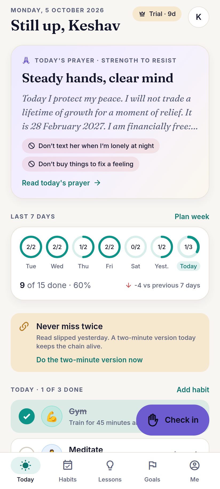 | 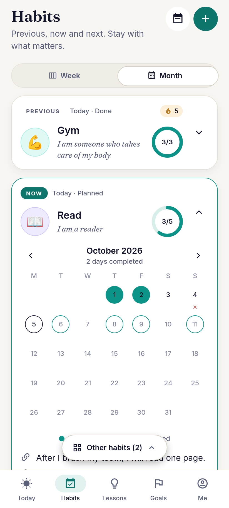 | 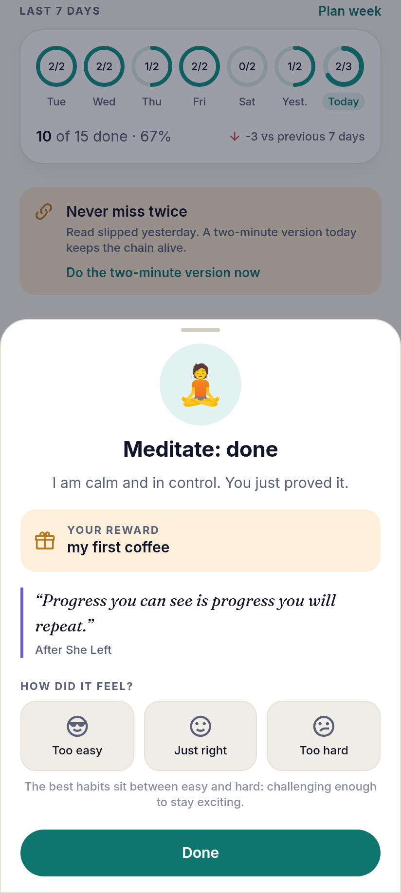 | 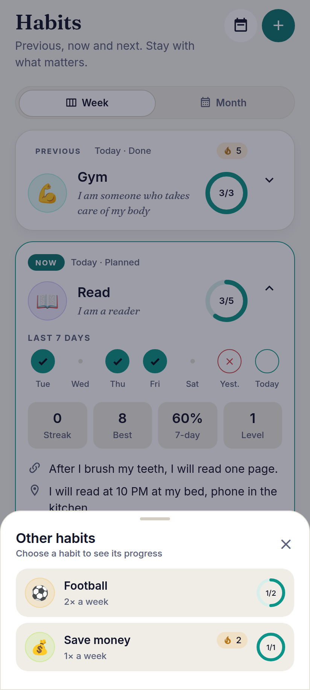 |

## 8. Habit system (Atomic Habits)

| Law | In the app |
|---|---|
| **Make it obvious** | Implementation intention ("I will [behavior] [when] at [where]"), habit stacking ("After I…, I will…"), weekly planner, nudges |
| **Make it attractive** | Identity statement on every card ("I am someone who…"), temptation bundling field |
| **Make it easy** | Two-minute version; **beginner mode** (first 21 days, ≤ 3 habits, two-minute versions; unlocks early after 14 days at ≥ 80 % consistency) |
| **Make it satisfying** | Completion sheet with the reward, a fresh quote and a difficulty rating; rings; streaks; **never miss twice** banner and evening nudge |

**Weekly targets, flexible timing.** Gym 3×, football 2× — no fixed times. `distributeWeek()`
plans the remaining sessions from today on by maximising the circular gap between sessions of the
same habit, preferring preferred weekdays, balancing load, and keeping two *hard* habits off the
same or adjacent days. Users can move any session to another day.

**Goldilocks rule.** After each completion: *too easy / just right / too hard*. Over 14 days:
≥ 80 % done and ≥ 60 % "too easy" → suggest **level up** (+10 % on the numbers in the full version,
at least +1); < 50 % done or ≥ 50 % "too hard" → suggest **making it smaller** (−20 %). Competing
with yourself: rings vs the previous 7 days, best streaks, levels and an insights leaderboard.

**Quotes that never feel repetitive.** 97 entries (original lines + public-domain classics; book
ideas are paraphrased, never copied). In-app: a **shuffle-bag** (no repeats until the deck is
exhausted, never one of the last 30). Notifications: a seeded permutation walked one step per day,
so a quote returns only after the whole library has been used.

## 9. Daily prayer (AI)

Three engines, cheapest and most private first (`src/domain/prayerEngine.ts`, tested). Each one
falls through to the next on any error, so the user always gets a prayer.

| Who | Engine | Cost | Data sent |
|---|---|---|---|
| Free plan | **Template composer** on the phone (`composeTemplatePrayer`) | $0 | Nothing |
| Trial / Premium on a supported phone (Pixel 10, Galaxy S24/S25, Fold/Flip 6, some Xiaomi, Motorola, Honor…) | **Gemini Nano** on the phone (ML Kit GenAI Prompt API) | $0 | Nothing |
| Trial / Premium on other phones (signed in) | **Claude Haiku 4.5** via `generateDailyPrayer` | ~$0.004 | Compact summary (below) |

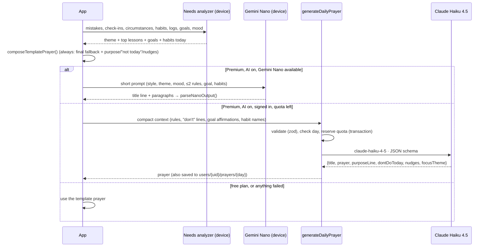

- **Needs analyzer** scores themes from named signals: slips in the last 14 days and circumstances
  scheduled today → *resist*; habits missed yesterday → *discipline*; mood → *forgiveness / courage
  / resist*; streaks ≥ 5 → *gratitude*; goals or milestones near → *purpose*. "Why this prayer?"
  shows the signals to the user.
- **Styles**: secular affirmation (default), spiritual (God / the Universe), or *my faith* with the
  name the user prays to.
- **Gemini Nano** (`modules/gemini-nano`): a Java engine over `GenerativeModelFutures` (checkStatus,
  download, generateContent) with a thin Kotlin Expo module. At startup, trial/Premium users' phones
  are checked and the model is downloaded in the background through AICore; free users never
  trigger a download. Generation uses temperature 0.7, topK 16, 400 output tokens and a 20 s
  timeout. The small model writes only the title and paragraphs; `parseNanoOutput()` strips
  markdown and quotes, drops a cut-off last sentence and rejects meta text ("as an AI…"), too
  short or too long output. The purpose line, "not today" lines and nudges come from the
  deterministic composer. On-device rewrites use no quota. Settings → Daily prayer shows where the
  prayer is written (ready / downloading / download button / cloud).
- **Privacy**: on-device prayers send nothing. For the cloud, only if–then rules, "don't" lines,
  goal affirmations, habit names and the mood are sent. Stories, reasons and feelings never leave
  the phone (covered by a unit test).
- **Cost** (list price, $1 / $5 per MTok for Haiku 4.5): ~1.5 K input + ~0.5 K output tokens ≈
  $0.003–0.005 per cloud prayer, so about $0.12 per cloud Premium user per month at one prayer a
  day (up to ~$0.36 if every rewrite is used). Free users and Gemini Nano phones cost $0. The system
  prompt is below the minimum cacheable size, so prompt caching isn't used.
- **Failure modes**: Gemini Nano busy, quota-limited, timed out or unusable → cloud → template.
  Cloud refusal (`stop_reason: "refusal"`) or API errors refund the reserved quota and the app
  falls back to the template prayer. Free-plan calls to the function are rejected server-side.

## 10. Reminder engine

`planNotifications()` (pure) returns every notification the device *should* have for the next 7
days; `syncReminders()` cancels and reschedules to match (idempotent, debounced 2 s after data
changes, on start, and from the background task).

| Reminder | Trigger | Notes |
|---|---|---|
| Morning prayer | daily at prayer time | neutral text by design |
| Circumstance | weekly per weekday at its time | free tier: first 3; privacy mode hides the lesson |
| Place | geofence enter/exit (≤ 95 regions) | per-place cooldown, quiet hours respected, lesson from a cached store |
| Lesson review | date, on days with lessons due | one digest, not one per lesson |
| Weekly planning | Sunday 7 PM | |
| Quote nudge | ~4 per week, random time in active hours | only on days with planned habits; never in quiet hours |
| Never miss twice | today 7:30 PM | only if a habit was missed yesterday and isn't done yet |

Android channels: *Lesson reminders* (high), *Morning prayer*, *Habit nudges*, *Lesson review*;
action buttons **Done ✓ / Snooze 1h** (habits) and **Avoided ✓ / Open lesson** (lessons) work
without opening the app. Permissions: POST_NOTIFICATIONS, SCHEDULE_EXACT_ALARM, background location
(with an in-app prominent disclosure before the system prompt).

## 11. Pricing, trial, ads & limits

- **Trial**: 14 days of everything, no card. Local installs start it at onboarding; signed-in
  accounts get it from the `onUserCreated` function so it can't be extended by changing the clock.
- **Premium**: **$20 / month** auto-renewing Google Play subscription via RevenueCat (localised
  price shown from the store). RevenueCat webhook → `revenuecatWebhook` → `users/{uid}.plan`.
- **Free tier** (one config in `src/domain/entitlements.ts`):

| | Free | Premium |
|---|---|---|
| Active habits | 5 | Unlimited |
| Active goals | 10 | Unlimited |
| Lessons | 25 | Unlimited |
| Location reminders | 1 | Up to 95 |
| Scheduled reminders | 3 | Unlimited |
| Daily prayer | Composed on the phone (mood re-writes included) | AI-written daily (Gemini Nano on the phone or the cloud) + 2 rewrites |
| Habit history (month view) | 3 months | Full |
| Insights | Basic | Full |
| Ads | Yes | None |
| App lock, export, cloud sync | Included | Included |

- **Ads**: AdMob banner only on list screens (Lessons, Goals, Insights) and at most one
  interstitial per day after auto-planning the week. **Never** on the lock, prayer, check-in or
  lesson screens. Non-personalised by default, PG content rating, UMP consent.
- **Downgrade**: nothing is deleted. The user picks which 5 habits / 10 goals stay active; the rest
  are *paused* (read-only) until they upgrade.
- **Enforcement**: limits in store actions (client); the cloud AI quota on the server, because it
  is the only limit that costs money (free plan: 0 cloud prayers).

## 12. Security & privacy

- **App lock**: biometrics or device PIN on launch and after 0 s / 30 s / 1 min / 5 min in the
  background (full-screen overlay; turning it on requires a successful unlock first).
- **Hide in recents & screenshots** (FLAG_SECURE), **private notification text**, lock-screen
  visibility *private* on every channel.
- **Data**: local-first; optional cloud sync is owner-only (rules) and encrypted in transit; JSON
  export is always free; account deletion erases the Firestore subtree and the Auth user.
- **Later**: client-side encryption of free-text fields (AES-GCM with a passphrase-derived key).
  Trade-off: a forgotten passphrase means lost cloud data, and server-side AI would need the user to
  opt into sending decrypted summaries.

## 13. Design system: Calm night

Dark-first, quiet surfaces, one strong accent per meaning. The light theme is its own set of steps,
not an inversion. Colours were checked with a contrast/CVD validator.

| Token | Dark | Light | Meaning |
|---|---|---|---|
| bg / surface / raised | `#0B0E1A` / `#121729` / `#1A2036` | `#F7F6F2` / `#FFFFFF` | ink night / warm paper |
| text / muted | `#EEF0F8` / `#9AA3BF` | `#12152A` / `#5A6079` | ≥ 7:1 / ≥ 6:1 |
| **teal** primary | `#2DD4BF` | `#0D9488` (marks) · `#0F766E` (buttons) | progress, done |
| **amber** accent | `#F5B544` | `#B7791F` | streaks, rewards |
| **violet** | `#8B7CF6` | `#6D5BD0` | prayer, purpose |
| **coral** danger | `#F27474` | `#D14343` | missed, slips (always with an ✕ or icon) |

- **Type**: Fraunces for titles, prayers and affirmations; Inter for everything else; numbers in
  the same sans (never serif) for readability.
- **Data viz rules**: rings and bars are meters on a same-ramp track; labels use text colours,
  never the mark colour; state is never colour-only (✓, ✕, "Rest"); charts have a text table twin.
- **Motion**: ring fill, accordion with rotating chevron, spring bottom sheets, checkbox pop with
  haptics, press-scale on every touchable.
- **Components** (`src/ui`): Text, Screen, FormSection, Card (filled / outlined / tonal / hero /
  prayer / sunken), Button (6 variants × 3 sizes), IconButton, FAB, Chip, Badge, Avatar, ListItem,
  SectionHeader, Divider, EmptyState, Skeleton, Banner, StreakBadge, TextField, Select,
  DateField + DatePickerSheet, TimeField, SegmentedControl, Switch, Checkbox, RadioGroup,
  RatingPills, Counter, WeekdayPicker, SwatchPicker, EmojiPicker, Stepper, ProgressBar,
  ProgressRing, Last7DaysRings, WeekStrip, MonthCalendar, StatTile, ColumnChart, Accordion,
  BottomSheet, Dialog, Snackbar. All are shown live on **Me → Design system** (`/ui-kit`).

## 14. Code layout

```
src/
  app/                  expo-router routes (tabs, stack screens, settings, ui-kit)
  domain/               pure logic + types (+ __tests__)
  store/                zustand store, hooks/selectors, defaults, demo data (+ __tests__)
  services/             firebase, sync, prayer, onDeviceAi, notifications, geofence, lock,
                        billing, ads(.native), background, haptics
  features/             screen-specific components (habits, lessons, goals, prayer, today)
  components/           app-level components (TabBar, LockOverlay, Upsell, AdBanner, BrandMark)
  ui/                   design-system components
  theme/                tokens + ThemeProvider
  content/quotes.ts     nudge library
  config/env.ts         EXPO_PUBLIC_* configuration
modules/gemini-nano/    local Expo module: Gemini Nano (Java engine + Kotlin module + TS wrapper)
functions/              Firebase Cloud Functions (TypeScript)
firestore.rules · firebase.json · eas.json · app.json
```

## 15. Testing & verification

- **Unit tests (Jest, 79 tests)**: dates (leap years, DST, ISO weeks), rolling 7-day rings,
  per-habit stats and streaks, Previous/Now/Next selection, weekly distribution, spaced review,
  beginner mode, Goldilocks, number scaling, shuffle-bag and quote cycle, pricing limits and
  downgrade, needs analyzer, template prayer (incl. the privacy guarantee), reminder planner, store
  limit enforcement, AI quota, component tests for rings and stat tiles, and the prayer engine:
  engine order for every plan/status, Gemini Nano prompt and output parsing, and the prayer service
  with the native module mocked as available, unavailable, failing, slow and unusable (each
  fallback, no quota for on-device rewrites, one shared generation for concurrent calls).
- **Native module**: the Java engine was compiled against stubs of the ML Kit API; Kotlin and the
  real ML Kit artifact are compiled only by `eas build` (no Android SDK in CI here). `expo prebuild`
  confirms the module is autolinked and `android.minSdkVersion=26`.
- **Functions tests** (`node --test`): tiers (free plan: 0 cloud prayers), plausible days,
  RevenueCat mapping, schema and output normalisation.
- **Static checks**: `tsc --noEmit`, `expo lint` (incl. React Compiler rules) — both clean.
- **Bundles**: `expo export -p web` and `-p android` both succeed.
- **Visual**: the web build was driven with headless Chromium at 412 × 915 in dark and light themes
  with sample data; zero console errors; screenshots in `docs/screenshots`.
- **Manual on device** (not possible in CI here): notification delivery and actions, exact-alarm
  behaviour, geofences (`adb emu geo fix <lng> <lat>`), Doze (`adb shell dumpsys deviceidle
  force-idle`), biometric lock, Play Billing license testers, AdMob test ads, and Gemini Nano on a
  supported phone (the native module is compiled only by `eas build`; see README).

## 16. Play Store checklist

- [ ] Background location declaration + prominent in-app disclosure (built) + demo video.
- [ ] Data safety form: personal info (name, email), app activity, location (on device only),
      AI processing (summary sent to the prayer function, only on Premium phones without
      Gemini Nano), ads SDK.
- [ ] "Contains ads" flag; ads never in sensitive flows; content rating questionnaire.
- [ ] Subscription listing: $20 monthly base plan, clear price/renewal/cancel terms (on paywall).
- [ ] Privacy policy URL (`EXPO_PUBLIC_PRIVACY_URL`) and terms URL.
- [ ] Target the SDK level EAS uses for SDK 57; signed AAB via `eas build -p android --profile production`.

## 17. Roadmap

| Phase | Scope | Status |
|---|---|---|
| 0 | Project setup, design system, domain layer | ✅ |
| 1 | Lessons, circumstances, check-in, reminders, habits + planner, dashboard rings | ✅ |
| 2 | Habit viewer, Goldilocks, quote nudges, goals, daily prayer (template + AI) | ✅ |
| 3 | Trial, subscription, paywall, free-tier limits, ads, downgrade | ✅ |
| 4 | Geofences, spaced review, insights, cloud sync | ✅ (device QA pending) |
| 5 | Home-screen widget, app shortcuts, Google sign-in, App Check, E2E encryption, Play release | 🔜 |
